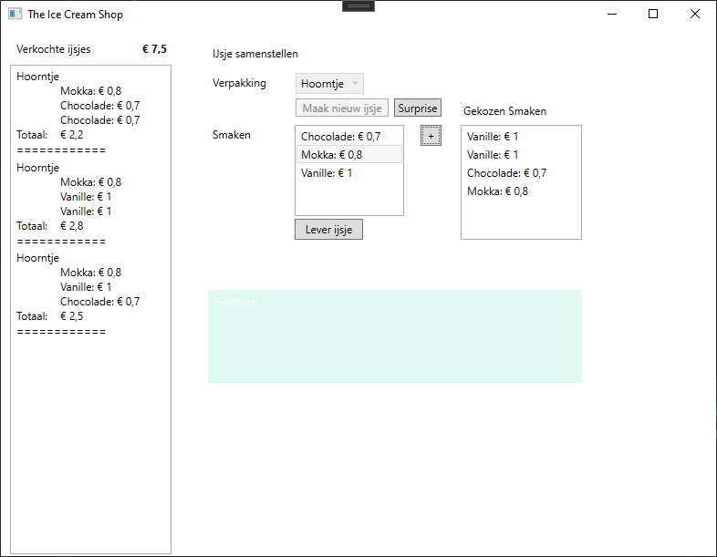

# The Ice Cream Shop

## EE PRB 2020-2021 JH2

Je maakt een applicatie voor een ijsjeskraam.
Er kunnen ijsjes besteld worden voor drie soorten verpakkingen (Hoorntje, potje en wafel).
Per verpakking kunnen er verschillende bolletjes ijs voorzien worden.
Er kunnen ook verrassingsijsjes met de gegeven verpakking aangemaakt worden. Dit ijsje bevat drie bollen met elk een willekeurige smaak.
Van alle verkochte ijsjes wordt de totale omzet bijgehouden.


De applicatie heeft één project:

- Prb.Ee.Icecreams.Wpf

## Core project
Voeg aan de solution een nieuw project toe met de naam `Prb.Ee.Icecreams.Core`.

### Enum PackageType
Maak een nieuwe enum in het **Core project** met als naam `PackageType` in een folder met de naam **Enums**.
Voorzie volgende elementen hierin:
- Hoorntje
- Potje
- Wafel

### Klasse Flavour
Maak een nieuwe klasse in het **Core project** met als naam `Flavour` in een folder met de naam **Entities**.

#### Properties

Bevat de volgende **read-only** properties:

- Price (decimal)
- Name (string)

#### Constructor

Bevat één constructor die twee parameters ontvangt:

- name (string)
- price (decimal)

#### ToString

Zorg ervoor dat Flavour als volgt wordt voorgesteld:
`Vanille: € 1`. Bekijk hiervoor ook de screenshots.

### Klasse Icecream
Maak een nieuwe klasse in het **Core project** met als naam `Icecream` in een folder met de naam **Entities**.

#### Properties

Bevat de volgende **read-only** properties:

- Scoops (Collectie van de gekozen smaken voor dit ijsje)
- Package (gekozen waarde van de enum PackageType)

#### Constructor

Bevat één constructor die één parameter ontvangt:

- package (gekozen waarde van de enum PackageType)

In deze constructor wordt de collectie `Scoops` geïnitialiseerd.

#### ToString

Zorg ervoor dat Icecream als volgt wordt voorgesteld:

```
Hoorntje
		Vanille: 	€ 1
		Mokka: 		€ 0,8
		Vanille: 	€ 1
Totaal:	€ 2,8
=====================
```

Bekijk hiervoor ook de screenshots.

#### Methodes

Voorzie **ENKEL volgende public** methodes in deze klasse:

- `AddScoop` ontvangt een gekozen scoop en voegt dit toe aan de scoops
- `DeleteScoop` ontvangt een te verwijderen scoop en verwijdert dit van de aanwezige scoops
- `HasScoops` controleert of er minstens één bol aanwezig is en gebruikt hiervoor een `bool` als return type.

**Eigen private** methods mogen gerust aangemaakt worden.

### Klasse ShopService
Maak een nieuwe klasse in het **Core project** met als naam `ShopService` in een folder met de naam **Services**.

#### Properties

Bevat de volgende **read-only** properties:

- `Flavours` (Collectie van `Flavour`): Dit zijn de verschillende smaken die beschikbaar zijn in de shop.
- `SoldIcecreams` (Collectie van `Icecream`): Dit zijn de verkochte ijsjes.
- `Revenue`: Geeft ten allen tijde de totale omzet van de verkochte ijsjes terug.

#### Constructor

Bevat één constructor die geen parameter ontvangt.

- In deze constructor wordt de collectie `SoldIcecreams` geïnitialiseerd naar een nieuwe lege collectie.
- Bovendien wordt de collectie `Flavours` opgevuld met volgende smaken:
  - Chocolade - 0.7 euro
  - Mokka - 0.8 euro
  - Vanille - 1 euro

#### Methoden

Voorzie **ENKEL volgende public** methodes in deze klasse:

- `CreateSurpriseIcecream`: Maakt één verrassingsijsje met de gegeven `PackageType` aan. Dit ijsje bevat drie bollen met een willekeurige smaak. Dit net aangemaakte ijsje is dan ook de return waarde van deze methode.
- `SellIcecream`: ontvangt het verkochte ijsje en voegt dit toe aan de collectie van verkochtte ijsjes. Indien het ijsje nog geen bollen bevat, wordt een `ArgumentException` met gepaste message opgegooid. Zorg voor de gepaste afhandeling hiervan in de code behind.

**Eigen private** methods mogen gerust aangemaakt worden.

## WPF applicatie

Alle controls zijn reeds voorzien, je hoeft dus geen extra controls aan te maken.
Voorzie zelf de aanmaak en implementatie van volgende eventhandlers:

### Window_Loaded

- De combobox `cmbPackage` wordt opgevuld met de waardes uit de enum `PackageType` EN standaard wordt Hoorntje geselecteerd
- Er worden drie verrassingsijsjes met een hoorntje aangemaakt en verkocht
- De verkochte ijsjes worden getoond in de listbox `lstSoldIcecreams`
- `grdFlavours` is niet zichtbaar

### BtnCreateNewIcecream_Click

Er wordt een ijsje aangemaakt met de gekozen verpakking en de gebruiker kan kiezen uit de verschillende beschikbare smaken.
Indien er nog geen verpakking werd gekozen toon je hiervan een melding in de textblock `tblFeedback` met een rode achtergrondkleur.

### BtnCreateSupriseIcecream_Click

Er wordt een ijsje aangemaakt met drie willekeurige bollen/smaken. Dit ijsje is echter nog niet verkocht, enkel aangemaakt.
De willekeurig gekozen smaken worden getoond in `lstChosenFlavours` en kunnen desgewenst verder aangevuld worden, of er kunnen bollen terug verwijderd worden.

### BtnAddFlavour_Click

Er wordt een smaak/bol/scoop toegevoegd aan het ijsje.
Toon een foutmelding met rode achtergrondkleur indien er geen smaak was geselecteerd.

### LstChosenFlavours_MouseRightButtonUp

Bij rechtermuisklik op een eerder gekozen smaak/bol/scoop, wordt deze verwijderd van het ijsje. Ga hiervoor op zoek naar volgend event: `MouseRightButtonUp`

### BtnSellIcecream_Click

De verkoop van het ijsje wordt geregistreerd.
Indien alles correct is verlopen, toon je hiervan een melding in de textblock `tblFeedback` met een groene achtergrond kleur.
Anders toon je een foutmelding met rode achtergrondkleur, bv. wanneer er nog geen smaken werden toegevoegd.

## Tips

- Om een iteratie over de verschillende elementen van een enum te doen kun je volgende code gebruiken:

```C#
foreach (PackageType package in Enum.GetValues(typeof(PackageType)))
{
	// Doe iets
}
```
## Screenshots
### Na het opstarten


### Na het klikken op *Maak nieuw ijsje* 


### Na het klikken op *Suprise* 


### Na het klikken op *Lever ijsje* 


### Na het klikken op *Lever ijsje* wanneer geen smaken gekozen zijn


### Na het klikken op *+ (smaken kiezen)* 


### Na het klikken op *Lever ijsje* wanneer minstens één smaak werd gekozen
